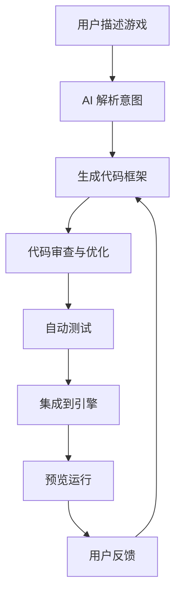

# 🎮 ThreeJSEvolution Engine

## 🧬 从演示到完整游戏引擎的进化路线

> **目标**: 创建一个类似 Unity 的 Three.js 游戏引擎，支持 AI 辅助开发

---

## 📋 总体架构

```
┌─────────────────────────────────────────────────────────────┐
│                    🎮 ThreeJSEvolution Engine                │
├─────────────────────────────────────────────────────────────┤
│                                                              │
│  ┌─────────────┐  ┌─────────────┐  ┌─────────────┐          │
│  │   🖥️ Editor  │  │   🧠 AI      │  │   📦 Asset   │          │
│  │   编辑器     │  │   代理       │  │   管理      │          │
│  └──────┬──────┘  └──────┬──────┘  └──────┬──────┘          │
│         │                │                │                  │
│         └────────────────┼────────────────┘                  │
│                          ▼                                   │
│  ┌─────────────────────────────────────────────────────┐    │
│  │              🔥 Core Engine System                   │    │
│  │  ┌─────────┐ ┌─────────┐ ┌─────────┐ ┌─────────┐   │    │
│  │  │ Game    │ │ Scene   │ │ Entity  │ │ Resource│   │    │
│  │  │ Loop    │ │ Manager │ │ System  │ │ Manager │   │    │
│  │  └─────────┘ └─────────┘ └─────────┘ └─────────┘   │    │
│  └─────────────────────────────────────────────────────┘    │
│                          │                                   │
│  ┌─────────────┬─────────┴─────────┬─────────────┐         │
│  ▼             ▼                   ▼             ▼         │
│  ┌─────────┐ ┌─────────┐   ┌─────────┐ ┌─────────┐         │
│  │Rendering│ │ Physics │   │ Animation│ │  Audio  │         │
│  │ 渲染    │ │ 物理    │   │ 动画    │ │ 音频    │         │
│  └─────────┘ └─────────┘   └─────────┘ └─────────┘         │
│         │             │            │          │             │
│         ▼             ▼            ▼          ▼             │
│  ┌─────────────────────────────────────────────────┐       │
│  │              📱 Platform Layer                   │       │
│  │  WebGL │ WebGPU │ Mobile │ Desktop │ VR/AR     │       │
│  └─────────────────────────────────────────────────┘       │
│                                                              │
└─────────────────────────────────────────────────────────────┘
```

---

## 🗂️ 模块详细设计

### 1️⃣ Core System（核心系统）

#### Game Loop（游戏循环）
```typescript
class GameLoop {
    start(): void
    stop(): void
    setFPS(target: number): void
    onUpdate(callback: (deltaTime: number) => void): void
    onRender(callback: () => void): void
}
```

#### Scene Manager（场景管理）
```typescript
class SceneManager {
    loadScene(name: string): Promise<void>
    unloadScene(name: string): void
    getActiveScene(): Scene
    createEmpty(name: string): Scene
}
```

#### Entity-Component System（实体组件系统）
```typescript
// 实体：场景中的对象
class Entity {
    addComponent<T>(type: ComponentType): T
    getComponent<T>(type: ComponentType): T | null
    removeComponent(type: ComponentType): void
    readonly name: string
    readonly transform: Transform
}

// 组件：功能模块
abstract class Component {
    entity: Entity
    enabled: boolean
    start(): void
    update(deltaTime: number): void
}

// 示例组件
class Transform { position, rotation, scale }
class MeshRenderer { material, mesh }
class RigidBody { mass, velocity, collider }
class AudioSource { clip, volume, loop }
```

#### Resource Manager（资源管理）
```typescript
class ResourceManager {
    load<T>(url: string): Promise<T>
    loadScene(url: string): Promise<Scene>
    preload(assets: string[]): Promise<void>
    get<T>(url: string): T | null
    unload(url: string): void
}
```

---

### 2️⃣ Rendering System（渲染系统）

#### Renderer（渲染器）
```typescript
class Renderer {
    render(scene: Scene, camera: Camera): void
    setPostProcessing(effects: PostEffect[]): void
    setQuality(level: Quality): void
    screenshot(): Promise<Blob>
}
```

#### Camera System（相机系统）
```typescript
class Camera {
    // 相机类型
    perspective(fov: number, aspect: number, near: number, far: number)
    orthographic(size: number, aspect: number)

    // 控制
    lookAt(target: Vector3): void
    orbit(target: Vector3, distance: number): void
    follow(target: Entity): void

    // 视图
    getViewMatrix(): Matrix4
    getProjectionMatrix(): Matrix4
    screenToWorld(screen: Vector2): Vector3
    worldToScreen(world: Vector3): Vector2
}
```

#### Lighting & Materials（光照与材质）
```typescript
// 光源类型
class Light {
    type: 'directional' | 'point' | 'spot'
    color: Color
    intensity: number
    castShadow: boolean
}

// 材质系统
class Material {
    // 内置材质
    static Basic: Material
    static Standard: Material  // PBR
    static Phong: Material
    static Physical: Material  // 高端 PBR

    // 自定义属性
    setTexture(key: string, texture: Texture): void
    setColor(key: string, color: Color): void
    setFloat(key: string, value: number): void
}
```

---

### 3️⃣ Physics System（物理系统）

```typescript
class PhysicsEngine {
    // 刚体
    createRigidBody(entity: Entity, config: {
        mass: number
        shape: 'box' | 'sphere' | 'capsule' | 'mesh'
        friction: number
        restitution: number
    }): RigidBody

    // 碰撞检测
    onCollision(callback: (a: Entity, b: Entity) => void): void
    raycast(origin: Vector3, direction: Vector3): RaycastHit

    // 触发器
    createTrigger(entity: Entity, size: Vector3): Trigger
}
```

---

### 4️⃣ Input System（输入系统）

```typescript
class InputManager {
    // 键盘
    isKeyDown(key: Key): boolean
    isKeyPressed(key: Key): boolean

    // 鼠标
    getMousePosition(): Vector2
    isMouseButtonDown(button: MouseButton): boolean
    getMouseScroll(): number

    // 触摸
    getTouches(): Touch[]

    // 游戏手柄
    getGamepad(index: number): Gamepad

    // 自定义输入映射
    bind(action: string, key: Key): void
    isActionPressed(action: string): boolean
}
```

---

### 5️⃣ Animation System（动画系统）

```typescript
class AnimationSystem {
    // 关键帧动画
    createAnimation(entity: Entity): AnimationClip {
        keyframes: Keyframe[]
        duration: number
        loop: boolean
    }

    // 骨骼动画
    loadModel(url: string): Promise<SkinnedModel> {
        animations: AnimationClip[]
        bones: Bone[]
        mesh: Mesh
    }

    // 混合
    blend(animA: AnimationClip, animB: AnimationClip, t: number): AnimationClip
}
```

---

### 6️⃣ Audio System（音频系统）

```typescript
class AudioSystem {
    // 2D 音效
    playSound(clip: AudioClip, volume?: number): void

    // 3D 音效
    play3DSound(clip: AudioClip, position: Vector3): AudioSource {
        spatial: boolean
        rolloff: number
        maxDistance: number
    }

    // 背景音乐
    playMusic(clip: AudioClip, loop?: boolean): Music {
        crossfade(duration: number): void
    }
}
```

---

### 7️⃣ UI System（用户界面）

```typescript
class UISystem {
    // 创建 UI 元素
    createCanvas(): UICanvas
    createText(parent: UICanvas): UIText
    createImage(parent: UICanvas): UIImage
    createButton(parent: UICanvas): UIButton
    createPanel(parent: UICanvas): UIPanel

    // 布局
    setLayout(layout: 'horizontal' | 'vertical' | 'grid'): void

    // 样式
    setStyle(component: UIComponent, style: UIStyle): void
}
```

---

### 8️⃣ AI System（游戏 AI）

```typescript
class AIGraph {
    // 行为树
    createBehaviorTree(): BehaviorTree {
        nodes: BTNode[]
        root: BTNode
    }

    // 状态机
    createStateMachine(): StateMachine {
        states: State[]
        transitions: Transition[]
    }

    // 寻路
    createNavigator(): Navigator {
        findPath(from: Vector3, to: Vector3): Vector3[]
        setObstacles(meshes: Mesh[]): void
    }
}
```

---

## 🤖 AI 辅助开发设计

### 🎯 核心理念

```
用户意图 → AI 理解 → 代码生成 → 自动测试 → 集成部署
    ↓
"做一个跑酷游戏"
    ↓
AI 生成:
  - Game.ts (主逻辑)
  - PlayerController.ts (玩家控制)
  - ObstacleManager.ts (障碍物)
  - ScoreManager.ts (计分)
  - 场景配置 JSON
```

### 📝 交互流程



### 🛠️ AI 工具集成

```typescript
interface AIDeveloper {
    // 自然语言 → 代码
    understandRequest(prompt: string): GameSpec

    // 生成游戏逻辑
    generateGameLogic(spec: GameSpec): GameCode {
        entities: EntitySpec[]
        components: ComponentSpec[]
        scenes: SceneSpec[]
    }

    // 生成组件
    generateComponent(name: string, features: string[]): ComponentCode

    // 生成场景
    generateScene(levelData: LevelSpec): Scene

    // 优化代码
    optimize(code: string): string

    // 生成文档
    generateDocs(code: string): string
}
```

---

## 📅 进化路线图

### Phase 1: 基础引擎（G1-G2）
- [ ] v1_base ✅ 基础场景
- [ ] v1_opt 鼠标交互
- [ ] v1_phys 物理引擎集成
- [ ] v1_anim 动画系统

### Phase 2: 核心系统（G3-G4）
- [ ] v2_core 实体组件系统
- [ ] v2_scene 场景管理
- [ ] v2_resource 资源加载
- [ ] v2_input 完整输入系统

### Phase 3: 高级功能（G5-G6）
- [ ] v3_ai 行为树/状态机
- [ ] v3_ui UI 系统
- [ ] v3_audio 3D 音频
- [ ] v3_nav 寻路系统

### Phase 4: 工具链（G7-G8）
- [ ] v4_editor 可视化编辑器
- [ ] v4_ai_dev AI 辅助开发
- [ ] v4_repl 在线 REPL
- [ ] v4_preview 实时预览

### Phase 5: 完整引擎（G9-G10）
- [ ] v5_full Unity 级别功能
- [ ] v5_cloud 云协作
- [ ] v5_marketplace 资源市场
- [ ] v6_ultimate 终极版本

---

## 🎯 下一步行动

从 **Phase 1** 开始，实现：
1. 集成物理引擎（Cannon.js）
2. 添加动画系统
3. 创建第一个可玩的示例游戏

需要我现在开始实现哪个部分？
